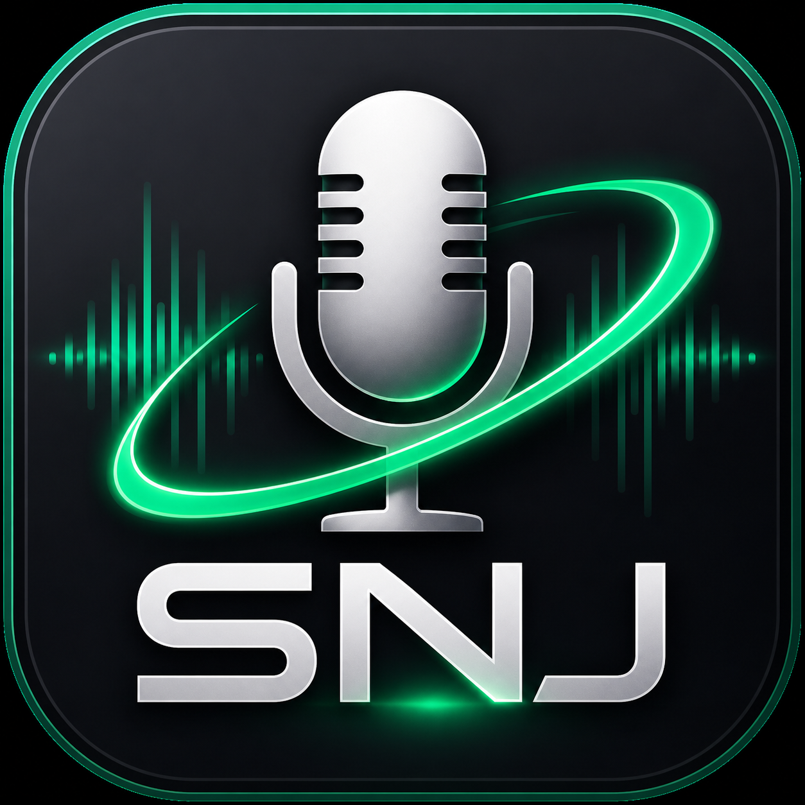

# Snj Voice Changer

<p align="center">
  
</p>

Snj Voice Changer is a Windows desktop voice changer that routes a real microphone through a VST3 plugin chain and into a virtual audio cable. It is built for calls, streams, experiments, and the happy little chaos of making your voice sound less ordinary.

```text
Real microphone -> Snj Voice Changer -> VST3 chain -> CABLE Input -> CABLE Output -> Meet / Discord / Chrome
```

## Download

The ready-to-install Windows build is in [`dist`](dist):

- [`dist/SnjVoiceChanger_v1.1.exe`](dist/SnjVoiceChanger_v1.1.exe)

Download and run the installer. It installs the app into `Program Files`, creates shortcuts, and can optionally launch the bundled VB-CABLE driver installer on the final setup screen.

## Requirements

- Windows 10/11 x64.
- VB-Audio Virtual Cable or a compatible virtual audio cable.
- VST3 plugins if you want effects in the chain.

VB-CABLE creates two important Windows audio endpoints:

- `CABLE Input` - playback/output device used by Snj Voice Changer.
- `CABLE Output` - recording/input device used by Meet, Discord, Chrome, OBS, etc.

Snj Voice Changer sends processed audio to `CABLE Input`. Your call or recording app should use `CABLE Output` as its microphone.

## Quick Start

1. Download [`SnjVoiceChanger_v1.1.exe`](dist/SnjVoiceChanger_v1.1.exe).
2. Run the installer.
3. Leave `Install VB-CABLE virtual audio driver` checked if VB-CABLE is not installed yet.
4. Launch Snj Voice Changer.
5. Select your real microphone in `InputDevice`.
6. Select `CABLE Input` in `OutputDevice`.
7. Press `Start`.
8. In Google Meet, Discord, Chrome, OBS, or another app, select `CABLE Output` as the microphone.
9. Add VST3 plugins to the chain if you want voice effects.

For best results, set your microphone and VB-CABLE endpoints to the same sample rate in Windows sound settings, preferably `48000 Hz`.

## Features

- Real-time microphone routing.
- Input and output device selectors.
- VB-CABLE endpoint detection.
- Input and output level meters.
- Compact latency diagnostics.
- VST3 plugin scanning.
- VST3 plugin chain processing.
- Plugin editor windows.
- Plugin enable/disable checkboxes.
- Plugin reorder controls.
- Dark Windows desktop UI.
- Self-contained installer with desktop and Start Menu shortcuts.

## VST Plugins

The current version supports VST3 plugins. VST2 support is planned for a later stage.

The installed app includes a default plugin folder under its `common` directory. You can also choose another folder from the UI and scan it manually.

## Notes

Snj Voice Changer does not install its own virtual microphone driver. It relies on VB-CABLE or another signed virtual audio cable. The bundled VB-CABLE installer is launched separately so you can choose whether to install the driver.

If the virtual cable was just installed, Windows may need a moment, an audio-device refresh, or a reboot before the new endpoints appear.

## Development

Open `SnjVoiceChanger.sln` in Visual Studio 2022 or newer.

Main projects:

- `SnjVoiceChanger` - C# WinForms application.
- `SnjVstHostNative` - native C++ VST3 host layer.

Build/research notes and handoff documents live in [`docs`](docs). Installer scripts live in [`publish`](publish).

## Status

The first working release line is complete. It routes audio, hosts VST3 plugins, opens plugin editors, installs cleanly, and is ready for real-world testing.
